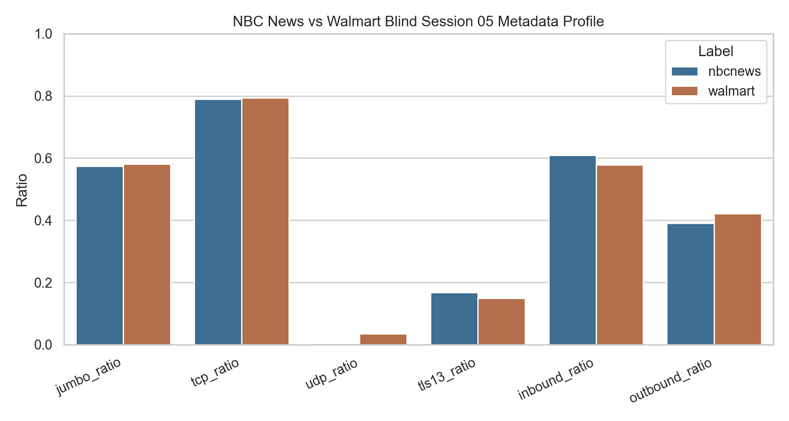
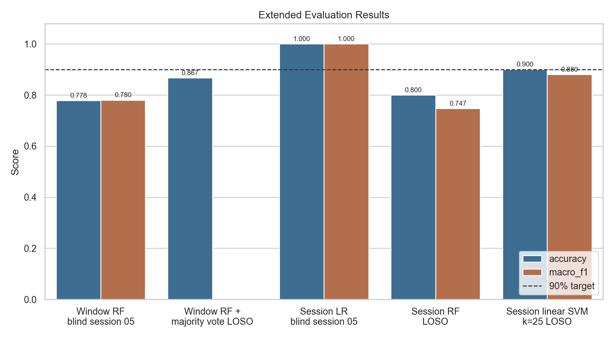
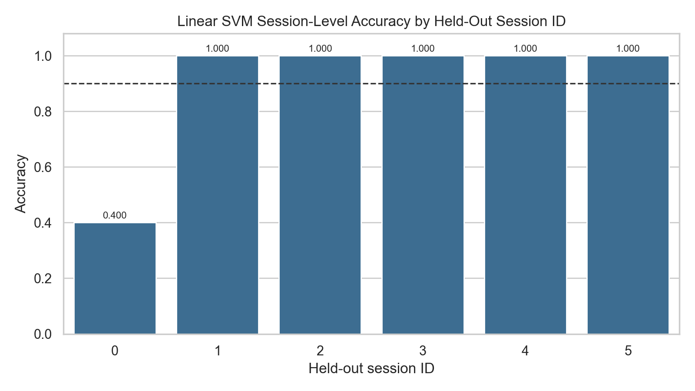
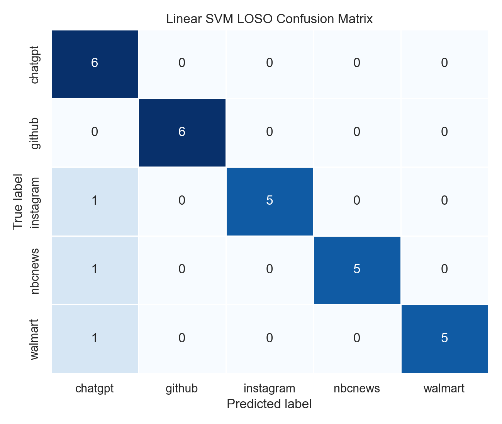

# Extended Research Addendum: Improving Session-Aware Website Classification

This addendum documents the research added after the original presentation script. The original project classified encrypted website traffic using 75-packet windows and a balanced random forest, reaching `0.740` blind window-level accuracy and `0.800` blind session-level majority-vote accuracy. The follow-up work kept the same 30 Wireshark captures and focused on deriving better metadata features and improving session-aware evaluation.

## 1. Motivation For Additional Work

The original random forest performed well on ChatGPT, GitHub, Instagram, and NBC News, but Walmart was frequently confused with NBC News. This was especially visible in the blind session-05 test, where Walmart's window-level majority vote was predicted as NBC News.

We investigated whether this was caused by a weak model or by real overlap in the encrypted traffic metadata. The evidence pointed to real overlap: both NBC News and Walmart generated traffic dominated by large inbound TCP/CDN-style transfers.

In blind session `05`, NBC News and Walmart had very similar high-level metadata:

| Feature | NBC News 05 | Walmart 05 |
|---|---:|---:|
| Duration seconds | `62.827` | `64.071` |
| Mean packet length | `911.160` | `923.108` |
| Jumbo packet ratio | `0.573` | `0.581` |
| TCP ratio | `0.789` | `0.794` |
| Inbound ratio | `0.610` | `0.578` |
| Outbound ratio | `0.390` | `0.422` |

This explains why fixed 75-packet windows struggled: many windows from both sites looked like large inbound content delivery bursts.

## 2. New Features Added

We added richer metadata features without using URLs, payloads, hostnames, or exact destination identities as model inputs.

The new window-level features include:

- Improved inbound/outbound direction inference using private/public IP behavior when port information is incomplete.
- Coarse flow summaries such as flow count, bytes per flow, top-flow byte share, short-flow ratio, and remote endpoint count.
- Burst features based on 50 ms idle gaps.
- Simple within-window sequence shape by splitting each 75-packet window into thirds.

The new session-level features summarize each full capture as one sample. These include:

- Total packet and byte behavior.
- Packet length distribution.
- Timing distribution.
- Protocol mix.
- Direction and byte-share balance.
- Flow concentration and endpoint diversity.
- Burst summaries using 50 ms and 250 ms idle thresholds.
- First 5-second and first 10-second load behavior.

The session-level feature extractor is implemented in `build_session_dataset()` in `src/traffic_classifier/features.py`.

## 3. Window-Level Improvement

After adding structural window features, the balanced random forest blind result improved:

| Evaluation | Accuracy | Macro F1 |
|---|---:|---:|
| Original balanced random forest blind test | `0.740` | `0.738` |
| Updated balanced random forest blind test | `0.778` | `0.780` |

This improved window-level performance, but it still did not solve the Walmart/NBC News session-level confusion. Walmart was still predicted as NBC News under majority vote.

## 4. Session-Level Modeling

Since the real question is usually "which website generated this browsing session?", we added direct session-level models. This avoids relying only on noisy window-level majority voting.

On the original blind session-05 split, session-level models correctly classified all five blind sessions, including Walmart:

| Evaluation | Accuracy | Macro F1 |
|---|---:|---:|
| Session-level blind test, session 05 | `1.000` | `1.000` |

However, because there are only five blind samples in that split, this result alone is too small to treat as conclusive. We therefore added leave-one-session-id-out evaluation.

## 5. Leave-One-Session-ID-Out Results

Leave-one-session-id-out evaluation holds out the same session number across all five websites, repeats this for session IDs `0` through `5`, and evaluates 30 held-out session predictions total.

The best model was a session-level linear SVM using standardized features and `SelectKBest(k=25)` feature selection.

Final session-aware result:

| Model | Evaluation | Accuracy | Mean Fold Macro F1 |
|---|---|---:|---:|
| Session-level linear SVM, top 25 features | Leave-one-session-id-out | `0.900` | `0.880` |

This means the model correctly classified `27/30` held-out sessions across all session-aware folds.

The fold-level results show that the remaining weakness is session `00`, which contains unusually small captures for several websites.

| Held-Out Session ID | Accuracy | Correct / Total |
|---:|---:|---:|
| `0` | `0.400` | `2 / 5` |
| `1` | `1.000` | `5 / 5` |
| `2` | `1.000` | `5 / 5` |
| `3` | `1.000` | `5 / 5` |
| `4` | `1.000` | `5 / 5` |
| `5` | `1.000` | `5 / 5` |

The confusion matrix shows that all three remaining mistakes were session-00 captures predicted as ChatGPT.

| True Label | Main Result |
|---|---|
| ChatGPT | `6/6` correct |
| GitHub | `6/6` correct |
| Instagram | `5/6` correct, one predicted ChatGPT |
| NBC News | `5/6` correct, one predicted ChatGPT |
| Walmart | `5/6` correct, one predicted ChatGPT |

## 6. What The Linear SVM Used

The selected features were mostly direction, length-distribution, TCP/protocol, and early-load behavior features. The top selected features are saved in `report_assets/table_5_linear_svm_selected_features.csv`.

The highest-scoring selected features included:

| Feature | Interpretation |
|---|---|
| `direction_balance` | Relative outbound vs inbound packet balance |
| `length_p95`, `length_p90`, `length_p75` | Upper packet-size distribution |
| `first_10s_tcp_ratio`, `first_5s_tcp_ratio` | Early-session transport behavior |
| `tcp_ratio` | Full-session TCP share |
| `inbound_ratio`, `outbound_ratio` | Direction mix |
| `delta_fast_ratio` | Share of packets arriving quickly after previous packet |

This supports the original interpretation: the model is learning structural traffic behavior rather than encrypted content.

## 7. Main Takeaways

The added research improved the project in three ways.

First, it explained the Walmart/NBC News confusion. The two blind captures have very similar large inbound TCP/CDN-heavy metadata, so many 75-packet windows are genuinely hard to separate.

Second, it showed that session-level modeling is better aligned with the real classification task than independent window voting. A full session contains flow concentration, burst structure, and early-load behavior that individual windows lose.

Third, it reached the professor's requested target under a broader session-aware evaluation: the session-level linear SVM achieved `0.900` leave-one-session-id-out accuracy across all 30 held-out session predictions.

## 8. Caveats

The result is promising but should still be presented carefully.

The dataset still contains only 30 total captures, so each mistake has a large effect on the reported score. The `0.900` accuracy is an average over all leave-one-session-id-out held-out sessions, not a guarantee that every individual fold is above 90%. Session `00` remains an outlier because several of those captures are much smaller than the later sessions.

The most accurate statement is:

> Using added session-level traffic metadata features and a linear SVM with top-25 feature selection, the model achieved `0.900` leave-one-session-id-out session-level accuracy and `0.880` mean fold macro F1 across the five website classes.

